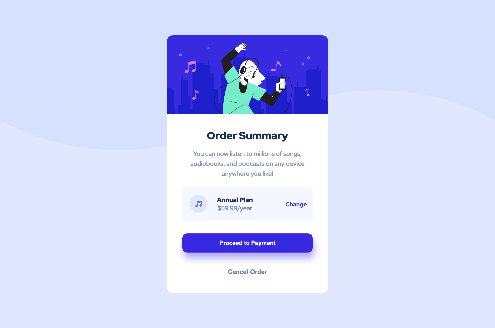
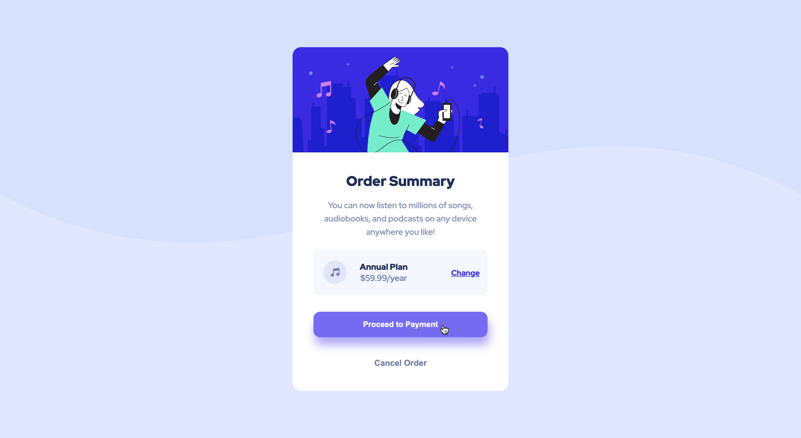

# Order summary card solution

## Table of contents

- [Overview](#overview)
  - [The challenge](#the-challenge)
  - [Screenshot](#screenshot)
  - [Links](#links)
- [My process](#my-process)
  - [Built with](#built-with)
  - [What I learned](#what-i-learned)

## Overview

### The challenge

Users should be able to:

- See hover states for interactive elements

### Screenshot

### Links

- Live Site URL: [https://ozantank.github.io/order-summary/](https://ozantank.github.io/order-summary/)

## My process

### Built with

- CSS custom properties
- Flexbox

### What I learned

I learned how to set images as background and how to style them.
